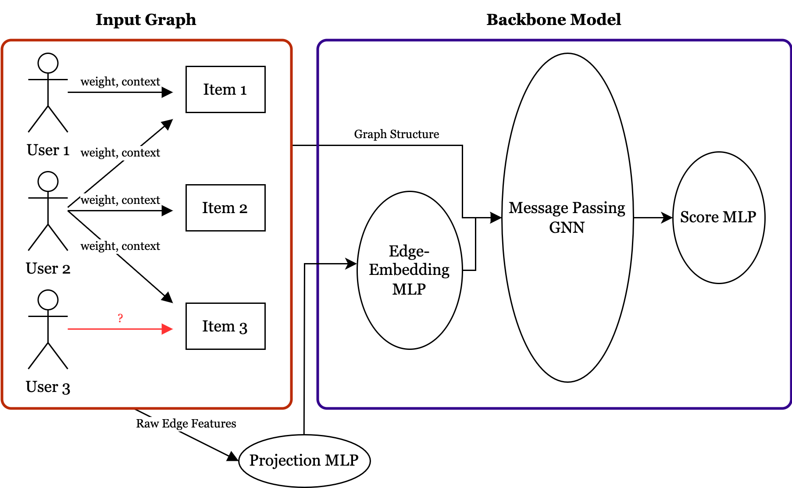

# GRUTL (Graph-based Recommendation using Transfer Learning)



This repository contains the codebase used for my bachelor thesis. You can find the full thesis document [here](asset/BA_Thesis_Report.pdf).
Please note that there are two branches, GRUTL and NBFnet, both containing the code for their respective models.
## Environment Setup
To ensure compatibility, please make sure the environments are up to date. Since both **pip** and **conda** were used, you need to install dependencies from both files:

### **Using Pip:**
```bash
pip install -r requirements.txt
```

### **Using Conda:**
```bash
conda env create -f environment.yml
conda activate <your_environment_name>
```

---

## Datasets
Refer to the **how_to_get_data** notebook for instructions on how to add datasets.

For a quick start, we recommend using **Gowalla**, as it automatically downloads all necessary files within the code.

---

## Running the Code

You can execute the script with the following command:
```bash
%run script/run.py -c config/notebook_cfg.yaml --dataset Gowalla --epochs 5 --gpus "[0]" --ckpt null --seed 42
```

### **Command Line Arguments:**
| Argument | Description |
|----------|-------------|
| `-c <yaml config>` | Path to the YAML configuration file. |
| `--dataset <dataset>` | Name of the dataset (e.g., Gowalla or another manually downloaded dataset). |
| `--epochs <int>` | Number of epochs to train. `--epochs 0` runs zero-shot inference, while `--epochs <= 2` is fine-tuning. |
| `--bpe <int>` | (Optional) Batches per epoch. Overrides default dataloader length. Example: `--bpe 100 --epochs 10` means 100 batches per epoch, leading to 1000 total training batches. |
| `--gpus <list>` | Specifies GPU usage. Example: `--gpus [0]` for a single GPU, or set multiple GPUs for a distributed setup. **Note:** This feature was not updated from the older codebase, so use with caution. |
| `--ckpt <path>` | Full path to a GRUTL checkpoint for loading a pre-trained model. Use `--ckpt null` to train from scratch (or run zero-shot inference on an untrained model). |
| `--seed <int>` | Seed for reproducibility. |
| `testgraph` | Set in the config file to check dataset consistency. |

---

## Running from a Jupyter Notebook
If you prefer to run the code from a notebook, use:
```bash
-c config/notebook_cfg.yaml
```

This ensures compatibility with Jupyter execution environments.

---

🚀 **Enjoy using GRUTL for graph-based recommendation tasks!**

